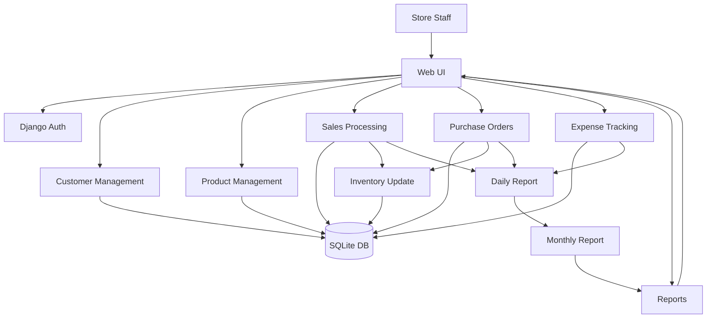

# Kirana Store Management System

A Django-based system for running a small grocery (kirana) store. It handles day-to-day sales, inventory, credit tracking, suppliers, purchase orders, expenses, and reporting with a single web dashboard.

## Key Features
- Dashboard with today sales, profit, transactions, pending credit, and low stock alerts.
- Sales workflow with invoice numbers, credit sales, and printable invoices.
- Inventory management with product categories, low stock thresholds, and stock report export.
- Customer management with credit tracking and credit clearance actions.
- Supplier and purchase order management with stock updates on completion.
- Expense tracking for operational costs.
- Reports: daily, monthly, and yearly profit charts plus sales analysis.
- Excel exports for stock, sales, and purchase orders.

## Use Cases
- Cashier records a new sale, prints the invoice, and stock is reduced.
- Owner tracks unpaid credit sales and clears customer credit when paid.
- Manager monitors low stock items and exports a stock report for reordering.
- Procurement creates a purchase order and marks it completed to increase stock.
- Accountant logs expenses and reviews profit trends in monthly and yearly reports.
- Admin exports sales data to Excel for accounting or audit use.

## Tech Stack
- Backend: Django 5.2.5 (Python 3.12)
- Database: SQLite (db.sqlite3)
- Frontend: Bootstrap 5 + Font Awesome
- Reports: Matplotlib (server-side chart rendering)
- Exports: OpenPyXL

## Project Structure
```
kirana_project/
  manage.py
  db.sqlite3
  kirana_project/
    settings.py
    urls.py
    views.py
    wsgi.py
    asgi.py
  accounts/
    urls.py
    views.py
  customers/
    models.py
    urls.py
    views.py
  products/
    models.py
    urls.py
    views.py
  sales/
    models.py
    urls.py
    views.py
    signals.py
  suppliers/
    models.py
    urls.py
    views.py
  reports/
    models.py
    urls.py
    views.py
  templates/
    base.html
    dashboard.html
    accounts/
    customers/
    products/
    sales/
    suppliers/
    reports/
  static/
    css/
    js/
    images/
```

## Data Model Overview
- Customer and CustomerCredit: track customer info and outstanding credit.
- ProductCategory and Product: inventory and pricing details.
- Sale and SaleItem: sales records and line items (with GST).
- Supplier, PurchaseOrder, and PurchaseItem: supplier purchases and restocking.
- Expense: operating costs.
- DailyReport and MonthlyReport: aggregated performance metrics.

## Data Flow Diagram (DFD)


## Screenshots


Add a real UI screenshot at the path above to replace this placeholder.

## Setup and Run
1. Create and activate a virtual environment.
2. Install dependencies.
3. Run migrations.
4. Start the development server.

### Windows (PowerShell)
```
python -m venv .venv
.\.venv\Scripts\Activate.ps1
pip install django openpyxl matplotlib
python manage.py migrate
python manage.py runserver
```

### macOS / Linux
```
python3 -m venv .venv
source .venv/bin/activate
pip install django openpyxl matplotlib
python manage.py migrate
python manage.py runserver
```

Open http://127.0.0.1:8000/ in the browser.

## Default Routes
- / : Dashboard
- /accounts/login/ : Login
- /customers/ : Customers
- /products/ : Products
- /sales/ : Sales
- /suppliers/ : Suppliers
- /reports/ : Reports

## Notes
- Credit sales are tracked with the Sale credit flags and CustomerCredit totals.
- Stock decreases on sale creation and increases when a purchase order is completed.
- Daily reports update automatically via sales signals.

## License
Add a license file if you plan to distribute or open-source this project.
